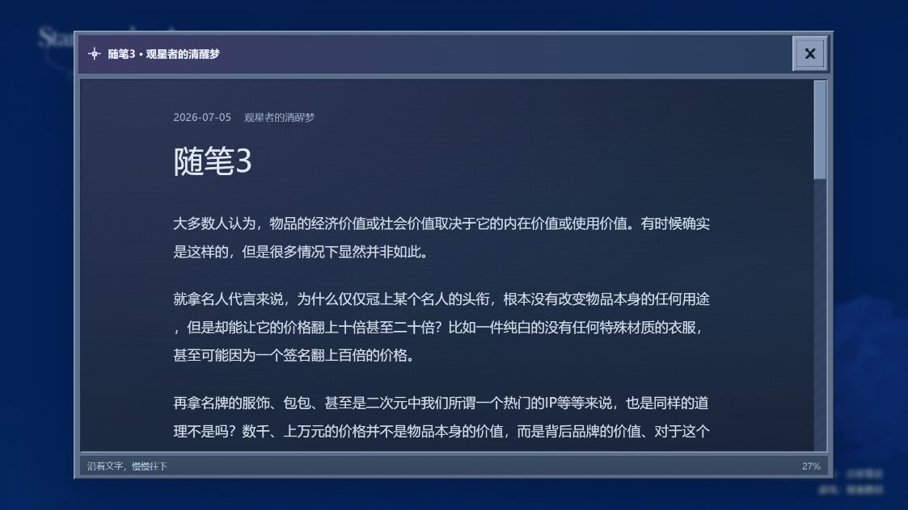
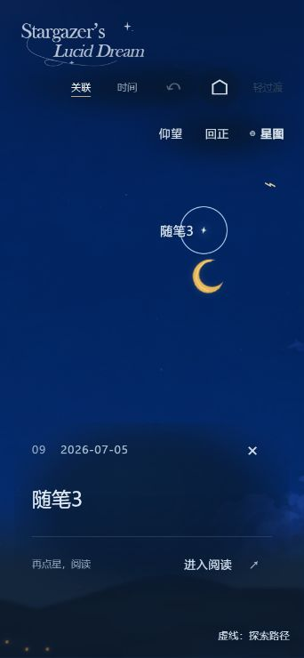
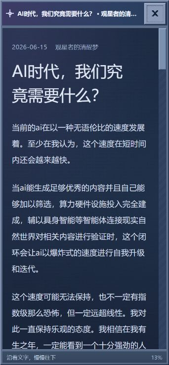

# 冷色复古阅读窗口与轻雾显字：正式落地

日期：2026-10-02。作者明确要求“用 1 方案。开始落地全部的决策”。实施分支 `codex/starfield-personal`，本地提交，不 push。

## 已确认的决定

- 保留 V20 插画、窗口入口、星空和原英文字标；中文阅读、标题与界面采用系统无衬线字体，配色转为冷蓝。
- 阅读窗口采用 Windows 95/98 凹凸窗框与像素 X，颜色为压暗蓝灰／蓝紫。X 的名称为“关闭文章，返回星空”，点击区域 44×44px，保留 Esc 和焦点返回。
- 正文底板使用低对比夜蓝／蓝紫渐变和 4.5% 静态颗粒；不覆盖文字或截获点击。滚动条使用冷色凹凸材质。
- 底部改为 24px 深蓝灰窄栏，去掉亮色凹槽，保留实际状态和百分比。
- 正文开合采用 B「视线聚焦」：440ms 淡入、轻微模糊转清晰，天空逐渐失焦至 2.4px；关闭为 240ms 淡出并恢复天空。没有旋转、斜向拉伸或星点缩回。轻过渡为 160/120ms 纯淡入淡出。
- 点星入口删除长摘要及冗余小标，保留日期、标题、取消选择、阅读按钮与原有关联入口。显字采用方案 1「轻雾显字」：微弱冷蓝底雾、低透明度和轻微模糊转清晰，移除白条与分色块。

首次点星的镜头与显字共享 1.1 秒时钟，去掉白块停顿；复访 700ms、轻过渡 220ms。显字完成后才记为复访，打断后仍可完整显露；靠近结束前阅读按钮保持禁用。

## 实现

正式模板提供标题栏与 X，标题随实际阅读文章更新。`reader.css` 集中窗口、正文与底栏样式，并清理旧的重复阅读规则。静态纹理通过 CSS 相对路径加载，不依赖试稿服务。

正文聚焦、标题显字与镜头沿用同一帧时钟。背景直接更新 `::backdrop` 自身规则，避免伪元素无法可靠继承窗口自定义属性的问题。快速反向开合从已显示的姿态继续；完成、取消或调整尺寸均清理暂停动画与临时滚动锁。

删除长摘要、重复正文引言与斜线印记；文章描述元信息仍保存并用于 SEO。真实 Markdown、图片、星位、原链接、旧主题和默认配置没有内容变更。没有合并试稿比较栏或 A/B/C 选择器。独立试稿保存在 `codex/prototype-retro-reader-20261002` 分支。

## 验证

- 19 项自动检查通过：10 篇真实文章、原地址和正文图片、重复准备不改文章或星位、双向关联、星点热区、降级行为，以及动画完成／中断／反向／尺寸调整／轻过渡／复访记忆。
- 新版静态生产构建成功，88 个文件，新增样式与纹理在静态产物内。
- 浏览器桌面 1123×631 CSS px：真实《随笔3》直达、关闭、重新点星、阅读、文末 100%、后退关闭和前进恢复均完成。落稳时正文无残留模糊或变换；完整动态背景实际为 `blur(2.4px)`。
- 首次点星实际检查到 `blur(3px)`、低透明度和 `aria-busy`，无白条或复制文字；完成后阅读按钮恢复。
- 浏览器窄屏 342×740 CSS px：正文无横向溢出，X 保持 44px，真实《AI时代，我们究竟需要什么？》标题截断不会覆盖 X，正文标题可换行。轻过渡背景实际为 `blur(0px)`，Esc 返回原文章星。
- 临时视口已恢复。本轮为浏览器布局与交互检查，没有触屏硬件或线上部署验证。

## 效果证据

