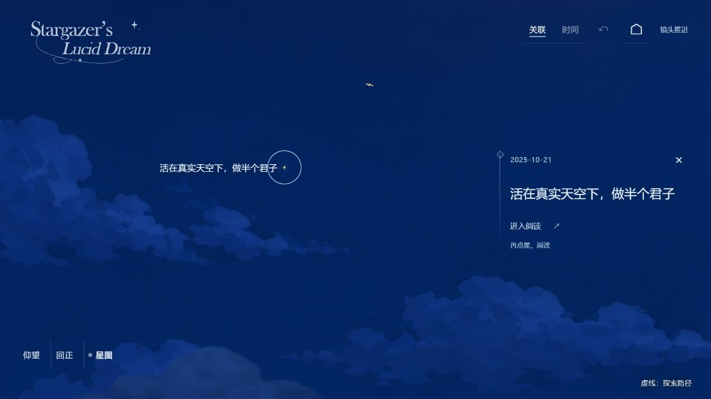
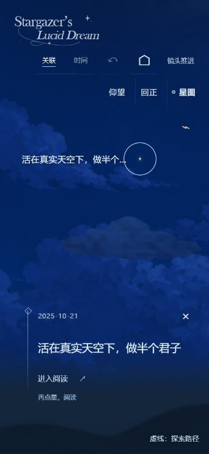
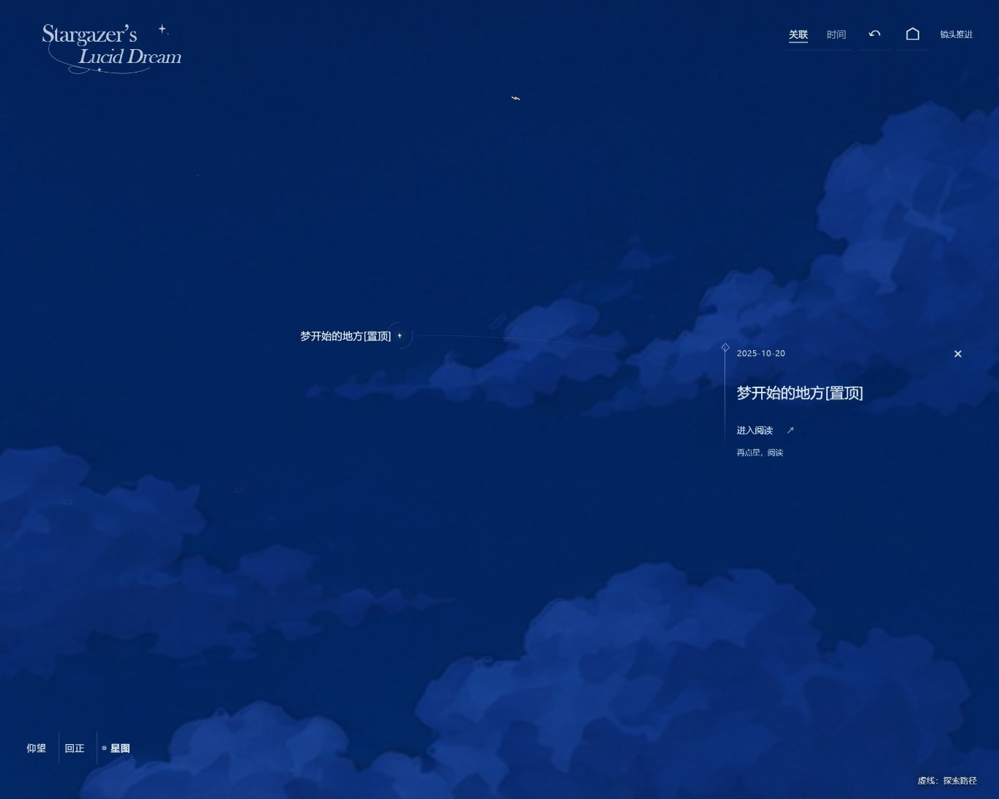

# B 观测注记：正式前端落地

日期：2026-10-03。作者明确确认当前原型可实际运用到项目前端。来源为 `codex/prototype-sky-ui-20261002` 的 `42b9ff7`；正式分支 `codex/starfield-personal`，实现提交 `a8dcc14`。本地提交，不 push。

## 已采用的界面

- 文章入口没有承载底板或黑雾，以冷蓝菱形标记和淡竖线定位。整体靠右、宽度收窄，内部左对齐；删除冗余文章序号，保留日期、取消选择、关联入口和作者理由。
- 桌面宽度 290–350px，右侧间距 16–40px，标题 20px；窄屏最大宽度 290px，距右 12px，标题 18px。阅读入口沿线排列，状态在其下方；X 与阅读入口保留 44px 高的点击区域。
- 探索和方位控制去掉模糊黑底与图标圆形暗底，采用冷蓝细线与分隔。天空和云层完整透出，文字只有微弱蓝色字影。
- 保留现有标题显字、点星靠近、两种模式、阅读窗口、B「视线聚焦」开合及阅读返回行为。

## 实现边界

直接修改正式主题的现有样式、模板及序号更新／显字选择器。阅读按钮在模板中位于状态之前，与实际视觉顺序一致。现有动画检查的元素夹具同步去掉已删除序号。

独立原型保存在原试稿分支，没有将试稿服务、A/B/C 比较栏、方案 URL 参数、快捷切换或初始自动关闭正文的逻辑加入正式页面。文章旧地址仍直接打开正文，首页仍从原窗边开始。文章内容、图片、稳定星位、旧 Kira 主题和默认配置均未修改。

## 验证

- `npm test`：19 项通过。覆盖真实文章原地址与图片、重复准备不修改内容或星位、双向关联、星点热区、降级行为和阅读／显字动画的完成、中断、反向及尺寸调整。
- `npm run build:starfield`：静态生产构建成功，88 个文件。预览与生产产物都由正式模板及样式生成。
- 正式预览 4181，桌面实际 1123×631 CSS px：真实《活在真实天空下，做半个君子》直达正文并关闭返回同文；注记宽约 314px、右侧约 25px、标题 20px。页面无横向溢出，导航与方位控制没有背景伪元素，图标背景透明，菱形无模糊；正式 DOM 中没有试稿工具或旧序号。
- 同文窄屏实际 342×740 CSS px：注记宽 290px、左约 40px、右约 12px，标题 18px，无横向溢出；X 44×44px、阅读入口约 112×44px。再次进入真实正文并关闭后，恢复同文文章星和阅读入口。
- 当前 4182，实际 1365×1091 CSS px：从正式窗边进入、首点真实《梦开始的地方[置顶]》只选中与靠近；显字结束后标题没有残留模糊，阅读按钮恢复。进入正文后保持正常阅读状态，关闭返回选中文章；页面没有试稿工具。
- 临时视口已恢复至 1123×631。此次为浏览器布局与交互检查，没有新增触屏硬件或线上部署验证。

正式预览：[当前 4182 首页](http://127.0.0.1:4182/)，[4181 首页](http://127.0.0.1:4181/)。4182 已从独立试稿注入服务改为正式主题静态预览服务，两个地址读取相同的正式生成目录；刷新原标签即可使用。旧 `variant` 查询参数不会添加比较工具，也不作为正式方案开关。独立试稿继续保存在原试稿分支。

## 效果证据

