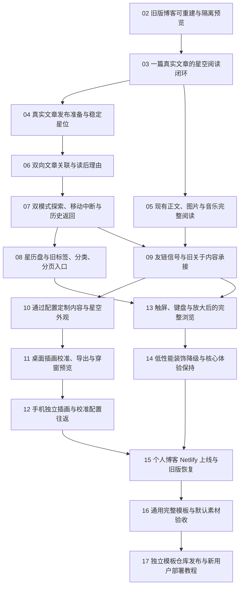

# 星空博客主题化：正式工单导航

日期：2026-09-30。
状态：用户已授权顺序自主实施；02–17 已发布为 ready-for-agent。

来源：[已确认规格](spec.md)。按 to-tickets 拆成 16 个可演示或可验证的任务，覆盖 68 条用户故事。现有 01 原型工单保持内容和状态，新的任务使用 02–17，发布前已核对编号未占用。

## 拆分方式

先完成旧版可恢复与隔离预览的准备工作，再以一篇真实文章建立正式内容和交互闭环。后续按访客/作者的完整行为拆分，每票包含输入、数据、呈现和外部验收，不分别建“只写 schema”“只写 API”“只写 UI”的横向工单。

桌面校准与手机独立校准拆成两次可以分别演示的交付，减少单次上下文负担。通用模板整理与远程发布/新用户托管验证也分别验收。没有需要按全仓机械迁移处理的宽重构，因此不新增 expand–contract 工单。

## 正式任务

1. **[02：旧版博客可重建与隔离预览](issues/02-legacy-recovery-baseline.md)**

   **Blocked by:** 无，可立即开始。**交付：** 作者能够从保存的源代码、配置和依赖重建旧版博客，并继续独立运行原型预览，为正式星空接入提供可恢复的基线。

2. **[03：一篇真实文章的星空阅读闭环](issues/03-first-real-article.md)**

   **Blocked by:** 02。**交付：** 访客能从当前窗边进入星空，选择一篇真实文章并阅读、返回；直接打开原地址或星空启动失败时，同址真实正文仍可读。

3. **[04：真实文章发布准备与稳定星位](issues/04-stable-article-publication.md)**

   **Blocked by:** 03。**交付：** 作者写完文章后运行本地准备步骤即可补身份、分配星位并预览，重复构建或新增文章不会移动关联模式旧星。

4. **[05：现有正文、图片与音乐完整阅读](issues/05-real-content-media-compatibility.md)**

   **Blocked by:** 03。**交付：** 访客在星空版和静态回退中完整阅读现有文章，图片、HTML、锚点及实际使用的音乐正常呈现，旧版仍能恢复。

5. **[06：双向文章关联与读后理由](issues/06-bidirectional-relations.md)**

   **Blocked by:** 04。**交付：** 作者只配置一条采用关系，两篇文章就能相互导航；访客读完当前文章后看到作者的理由，未确认候选不公开。

6. **[07：双模式探索、移动中断与历史返回](issues/07-modes-history-interruption.md)**

   **Blocked by:** 06。**交付：** 访客能在关联/时间模式间继续聚焦同文，途中改选或中断后不会误开正文，停靠返回及浏览器历史始终对应当前内容。

7. **[08：星历盘与旧标签、分类、分页入口](issues/08-archives-and-legacy-collections.md)**

   **Blocked by:** 07。**交付：** 访客通过星历盘抵达真实发表时期，旧标签、分类和分页链接在星空内打开对应文章清单，原内容范围保持正确。

8. **[09：友链信号与旧关于内容承接](issues/09-friends-and-legacy-about.md)**

   **Blocked by:** 05、07。**交付：** 访客能从友链信号了解朋友并主动访问外站，旧关于链接仍显示原内容与歌单，而新首页没有作者介绍入口。

9. **[10：通过配置定制内容与星空外观](issues/10-content-and-appearance-config.md)**

   **Blocked by:** 09。**交付：** 作者修改配置即可替换站点文案、朋友信息和星空/阅读外观，个人配置与通用主题实现分开，默认效果仍接近 V20。

10. **[11：桌面插画校准、导出与穿窗预览](issues/11-desktop-scene-calibration.md)**

   **Blocked by:** 10。**交付：** 使用者在本地界面载入不同构图的桌面图片，描画窗口与互动区域，导出配置后完成真实穿窗及返回，而不用改前端代码。

11. **[12：手机独立插画与校准配置往返](issues/12-mobile-scene-calibration.md)**

   **Blocked by:** 11。**交付：** 使用者能为手机配置独立插画和互动区域，横竖屏变化后窗口及穿窗仍对齐，桌面与手机配置可保存并再次导入。

12. **[13：触屏、键盘与放大后的完整浏览](issues/13-mobile-and-accessible-reading.md)**

   **Blocked by:** 08、09。**交付：** 手机与键盘访客能探索、读文、操作日期与旧内容层并返回，横竖屏和文字放大后核心控件仍可达。

13. **[14：低性能装饰降级与核心体验保持](issues/14-performance-graceful-degradation.md)**

   **Blocked by:** 13。**交付：** 设备能力不足时减少装饰星、云细节和微动，访客仍能穿窗、探索和阅读；渲染不可用时保留同址正文。

14. **[15：个人博客 Netlify 上线与旧版恢复](issues/15-netlify-release-and-rollback.md)**

   **Blocked by:** 12、14。**交付：** 作者在 Netlify 先验证预览再发布星空版，并实际验证恢复旧版的路径，保留可操作的日常写作和发布说明。

15. **[16：通用完整模板与默认素材验收](issues/16-generic-template-export.md)**

   **Blocked by:** 15。**交付：** 个人站点验证上线后，整理可复制的通用完整模板，使用示例文章和通用桌面/手机插画，空环境改配置即可预览和构建。

16. **[17：独立模板仓库发布与新用户部署教程](issues/17-public-template-publication.md)**

   **Blocked by:** 16。**交付：** 使用者从独立公开仓库复制模板，按教程改配置、写文和部署 Netlify，作者个人博客与旧版保持独立。

## 依赖图

图中只画直接阻塞边；完成所有直接前置即可进入相应任务，不再重复声明传递依赖。

## 可开始的工作与阶段汇合

- 初始 frontier 为 02。已有原型 01 的历史未完成项不作为本轮启动阻塞；实际设备限制在 13–15 中验证和记录。
- 03 完成后，04 发布准备和 05 正文媒体兼容互不阻塞。
- 07 完成后，08 日期/集合入口可推进；09 另需 05 的媒体能力。
- 09 完成后，10 外观配置可推进；13 设备与可读性另需 08。
- 12 完成双画幅校准，14 完成整站低性能体验，两者汇合后进入 15 发布与恢复。
- 16、17 受个人站点上线顺序约束；不提前创建公开模板仓库或替换当前远程/部署。

2026-09-30 用户授权在新对话中使用 GPT-6 Luna、最高思考强度和 goal 模式，按 02–17 顺序实施、验收并逐票 commit。单次只实施一票，后续票仍须满足依赖。

## 规格覆盖

| 工单 | 覆盖用户故事 |
| --- | --- |
| 02 | 4–5、66–68 |
| 03 | 6–7、21–23、25–27、34–35、39、41、53、66 |
| 04 | 1、8–16、19–20 |
| 05 | 7、42–43、67 |
| 06 | 17–20、31–33 |
| 07 | 15、28–30、34–40 |
| 08 | 48–49、52 |
| 09 | 50–52 |
| 10 | 16、19、52、56、62、66 |
| 11 | 58–61 |
| 12 | 57–62 |
| 13 | 24、38、44–46、67 |
| 14 | 41、46–47、53、67 |
| 15 | 2–5、67–68 |
| 16 | 54–62、64–66 |
| 17 | 54、63–65、67–68 |

逐票包含具体验收条件、演示、测试边界和规格来源。覆盖编号说明工作归属，不代表验收已经完成；真实内容/路由/设备/托管整合在 15 再核对。

## 确认和正式发布

2026-09-30 用户明确要求“开启新对话”“goal模式让它自主按顺序跑完所有的任务”“每完成一张任务就自主颗粒度commit一次”，据此确认拆分并授权进入实施。依照 to-tickets 的正式发布步骤，02–17 均已写入 issues，每票一份文件，状态为 ready-for-agent；01 原型父项与规格内容未改动。

原 ticket-drafts 目录作为发布前历史草案保留；实施以本导航所链接的 issues 为准，不再使用草案状态。逐票完成后记录真实验收证据并关闭该票，依赖完成后继续下一票。不得用关闭状态替代实际交付。

新对话启动提示词保存于 [自主实施交接](execution-handoff.md)。用户授权的是完整既定范围，常规实施决策不重复确认；确有外部权限或资料阻塞时据实记录。