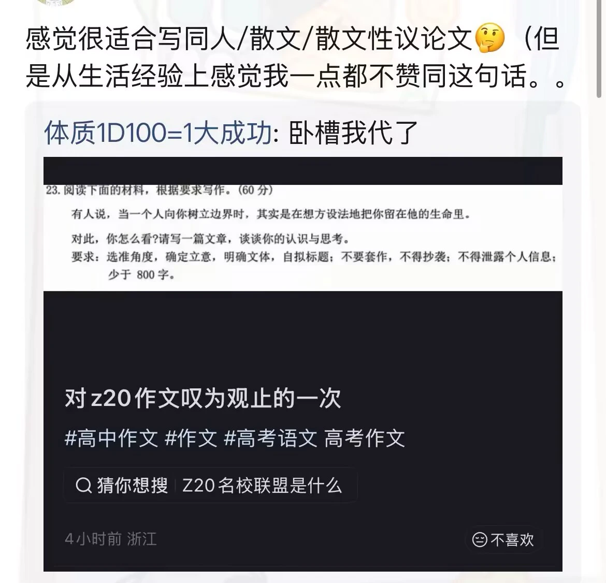

看到空间，突然有点想法，趁机写写，就当**练笔**练打字了。

首先我觉得这种以及类似的话都不具有那种，能当作一种“真理”或者说普遍的规则来当作自己的行事准则、塑造自己的理念意义。

这种话往往有很强的经验性，就像俗语一样，基本上没有什么具体的场景、背景，它有非常强的不确定性，是不可靠的，而且往往是自相矛盾的。例如：有人说“好人有好报”，马上有人说“好人没好报”；有人说“坚持才是胜利”，有人说“放弃才能成功”。

粗粗看来都有道理，在生活中都能找到对应的例子：黄仁勋在英伟达最困难即将破产的时候，忍辱低头去找世嘉谈合作，拿到了资金，坚持下来有了如今的AI巨头；雷军放弃了金山的CEO身份，转而成立了小米，实现了华丽转身……但是问题也出在这里，在没有背景因素，没有场景限定的情况下，忽略了真正重要的决定性因素，我们能说它有多少正确性吗？甚至于说不论实际地将这种俗语的结论就当作了自己的行事准则？比如在“坚持还是放弃”这个问题上，真正重要的是问题本身“想成功是应该坚持还是放弃”吗？明显不是，这个结果由运气、时机、人的性格、天分等等等等共同决定，在不同的情况下就是有不同的结果。但是当你人生中遇到了需要抉择坚持还是放弃的时刻，不论其他，而就因为那句“坚持才能成功”的经验性的俗语就决定坚持到底？这是否有些荒谬、不合理？

所以回到这句话，如果就单这句话本身，我觉得没什么好说的。不过我也觉得出卷老师应该也不是只想你从他给定的这一个角度来论述。（我觉得）一般应该只是给一个切入点，你自己展开论述相关的情景，然后辩证展开🤔但是想吐槽，说白了谁知道你出卷老师怎么想的😓

讲到这，想扯一点远的。

人往往会下意识地去揣测他人的想法，而且很多时候自大地认为自己能猜到别人怎么想的。如果你总是这样觉得，与其说你是第一个掌握了读心术的天才，还不如说你是一个近乎癫狂的疯子。

但是其实也是挺矛盾的，一方面知道意识到这一点，但是另一方面我们还是下意识的这样去做，而且很多时候我们也不可避免地需要去看别人的脸色，去想别人是怎么想的，我们所谓“情商”。

所以我觉得合乎中道的方法可能还是以开放的心态保持真诚和天真吧。一方面可能需要一些“眼力健”，至少对于比较明显的暗示，我们可以自己想想，但在绝大多数时候保持一份天真不去过多地思考别人的想法，如果真有事情我不知道你是怎么想的，那就应该带着真诚，去沟通和交流，相信对方一定是可以理解的。反而正是那些自以为为他人好，自以为理解对方，自作主张地做一些事，反而会适得其反。人与人交往中的很多悲剧、喜剧、无奈与遗恨都发生在这种良好交流的缺失中。

写完感觉自己想的会不会太理想了点，还是太难了，真的能做到吗😞
